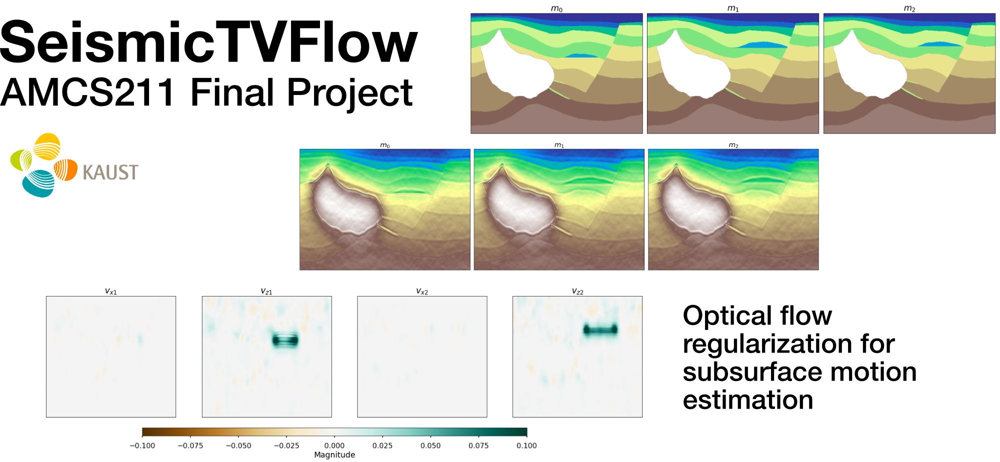

Implementation of Optical Flow regularization (as described in [Lucka, 2018](https://epubs.siam.org/doi/10.1137/18M1170066) and [Burguer, 2018](https://iopscience.iop.org/article/10.1088/1361-6420/aa99cf)) to 4D seismic inversion for subsurface body velocity estimation 

Danilo Chamorro Riascos\
AMCS211 Final Project\
King Abdullah University of Science and Technology

## Project structure
This repository is organized as follows:

* :open_file_folder: **Code**: set of jupyter notebooks reproducing the experiments in the report (see below for more details)
* :open_file_folder: **Data**: folder containing synthetic data used to train and test the models

## Notebooks
The following notebooks are provided:

- :orange_book: ``1_data_generation.ipynb``: notebook performing data generation from synthetic model
- :orange_book: ``2_forward_modeling.ipynb``: notebook performing the forward modeling problem 
- :orange_book: ``3_4D_TVFlow.ipynb``: notebook performing the 4D inversion using the TVTV2 with Optical Flow constraint 